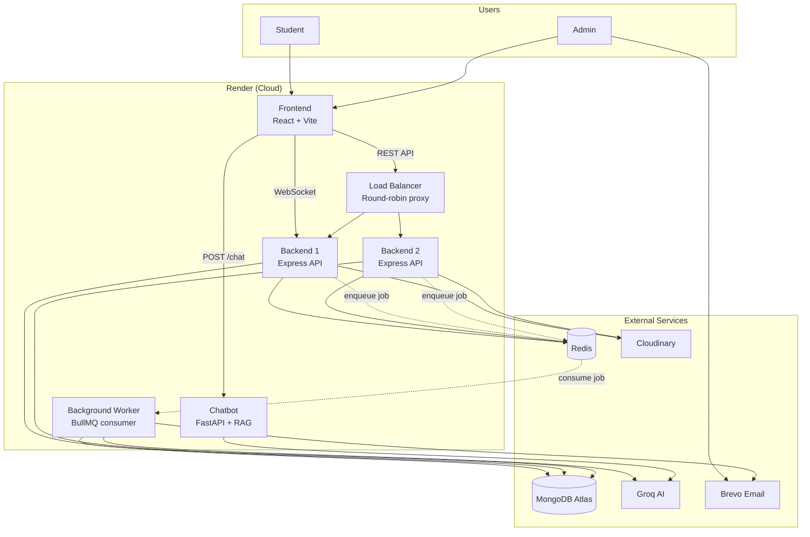
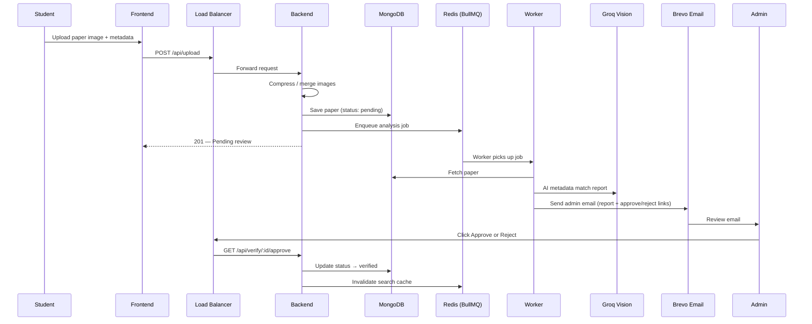
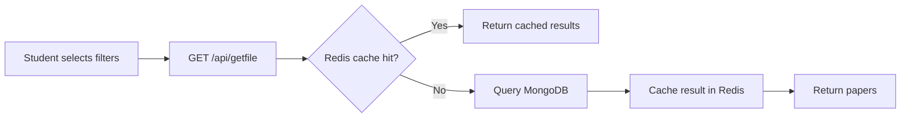

# JNTUH Exam Papers

A full-stack platform for **uploading, reviewing, and discovering JNTUH university exam papers**. Students can upload papers, browse verified papers with filters, and ask questions via an AI chatbot. Admins receive AI-assisted review emails and approve or reject uploads.

**Live demo:** [jntuh-exams-papers.onrender.com](https://jntuh-exams-papers.onrender.com)

---

## Features

- **Paper upload** — One-sided or two-sided (front + back merged) with image compression via Sharp
- **Admin verification** — Approve/reject via email links or the admin dashboard
- **AI-assisted review** — Groq Vision compares uploaded metadata against the paper image (advisory only — never auto-approves)
- **Verified paper search** — Filter by degree, regulation, semester, branch, subject, and exam type
- **RAG chatbot** — Ask natural-language questions and get answers grounded in exam paper data
- **Real-time online users** — Socket.IO live counter on the frontend
- **Production-ready infrastructure** — Load balancer, Redis cache, and BullMQ background jobs

---

## Architecture Overview



---

## Core Services

### 1. Load Balancer

A dedicated **Node.js reverse proxy** (`load-balancer/`) sits in front of two identical backend instances.

| Capability | Details |
|------------|---------|
| **Algorithm** | Round-robin across Backend 1 and Backend 2 |
| **Health checks** | Polls `/health` (fallback `/api/ping`) every 15s |
| **Failover** | Unhealthy backends are skipped automatically |
| **Observability** | Adds `X-Upstream-Server` header so you can see which backend handled a request |

```
Frontend  →  Load Balancer  →  Backend 1  or  Backend 2
```

> **Note:** The load balancer handles **REST API traffic only**. Socket.IO (online users) connects directly to a single backend URL.

**Key files:** `load-balancer/server.js`, `load-balancer/backends.js`, `load-balancer/healthChecker.js`

---

### 2. Redis Cache (Cache-Aside)

Frequently searched paper listings are cached in **Redis** to reduce MongoDB load and speed up responses.

| Capability | Details |
|------------|---------|
| **Pattern** | Cache-aside on `GET /api/getfile` |
| **Cache key** | Built from query filters (`degree`, `branch`, `semester`, etc.) |
| **TTL** | Configurable via `CACHE_TTL_GETFILE_SECONDS` (default: 600s) |
| **Invalidation** | Cleared when admin approves a paper |
| **Graceful fallback** | If Redis is down, requests go straight to MongoDB |
| **Debug headers** | `X-Cache: HIT/MISS`, `X-Data-Source: redis/mongodb` |

```
Request  →  Redis GET (hit?)  →  return cached JSON
                ↓ miss
           MongoDB query  →  store in Redis  →  return JSON
```

**Key files:** `backend/middlewares/cache.middleware.js`, `backend/services/redis.service.js`, `backend/utils/cacheKeys.js`

---

### 3. BullMQ (Background Job Queue)

Slow work after upload — **AI analysis** and **admin email** — runs in a separate worker process so the API responds instantly.

| Capability | Details |
|------------|---------|
| **Queue name** | `paper-analysis` |
| **Producer** | Upload route enqueues a job after saving to MongoDB |
| **Consumer** | Standalone worker (`npm run worker`) |
| **Job data** | `{ paperId }` — uses paper ID as job ID to prevent duplicates |
| **Retries** | 3 attempts with exponential backoff (5s base) |
| **Concurrency** | Configurable via `PAPER_ANALYSIS_CONCURRENCY` (default: 2) |

**Per-job flow:**

```
1. Fetch paper from MongoDB
2. Run Groq Vision analysis on Cloudinary image (optional — failure does not block email)
3. Send admin review email via Brevo (always)
```

**Key files:** `backend/queues/paperAnalysisQueue.js`, `backend/workers/paperAnalysisWorker.js`, `backend/worker.js`, `backend/config/bullmqConnection.js`

> Redis serves **two roles**: response caching (`node-redis`) and job queuing (`ioredis` via BullMQ).

---

### 4. RAG Chatbot (Retrieval-Augmented Generation)

A **FastAPI** service (`jntu-chatbot/`) answers student questions about exam papers using a lightweight RAG pipeline optimized for low-memory hosting (e.g. Render free tier).

| Stage | What happens |
|-------|--------------|
| **Retrieval** | Keyword + metadata scoring ranks papers from a local index (`data/exam_papers.txt`) |
| **Augmentation** | Top 5 matching papers are injected as context |
| **Generation** | Groq LLM writes a grounded answer — only from retrieved context, no hallucinated URLs |

```
User question  →  retrieve top papers  →  build prompt with context  →  Groq LLM  →  answer + sources
```

**Key files:** `jntu-chatbot/app/rag/retrieval.py`, `jntu-chatbot/app/rag/generation.py`, `jntu-chatbot/app/main.py`

---

## End-to-End Flows

### Upload → Review → Publish



### Search Verified Papers



---

## Tech Stack

| Layer | Technologies |
|-------|-------------|
| **Frontend** | React 19, Vite, React Router, Axios, Socket.IO Client |
| **Load Balancer** | Node.js, Express, http-proxy |
| **Backend API** | Node.js, Express 5, Mongoose, Multer, Sharp |
| **Background Jobs** | BullMQ, ioredis |
| **Cache** | Redis (node-redis) |
| **Database** | MongoDB Atlas |
| **File Storage** | Cloudinary |
| **AI** | Groq (Vision for paper analysis, LLM for chatbot) |
| **Email** | Brevo |
| **Chatbot** | Python, FastAPI, Groq SDK |
| **Hosting** | Render |

---

## Project Structure

```
jntuh-exams-papers/
├── frontend/              # React web app (upload, search, admin, chatbot UI)
├── load-balancer/         # Round-robin reverse proxy + health checks
├── backend/               # Express API, cache, upload, verify routes
│   ├── queues/            # BullMQ queue definitions
│   ├── workers/           # BullMQ job processors
│   ├── services/          # AI analysis, email, Redis
│   ├── middlewares/       # Auth, cache-aside
│   └── worker.js          # Standalone worker entry point
└── jntu-chatbot/          # FastAPI RAG chatbot service
    └── app/rag/           # Retrieval + generation pipeline
```

---

## API Endpoints

| Method | Endpoint | Description |
|--------|----------|-------------|
| `POST` | `/api/upload` | Upload exam paper (multipart form) |
| `GET` | `/api/getfile` | Search papers with query filters (cached) |
| `GET` | `/api/verify/:id/approve` | Approve a pending paper |
| `GET` | `/api/verify/:id/reject` | Reject a pending paper |
| `GET` | `/api/recent` | Recently uploaded papers |
| `POST` | `/api/auth` | Admin login |
| `GET` | `/api/ping` | Health check |
| `POST` | `/chat` | Chatbot (FastAPI service) |

---

## Getting Started

### Prerequisites

- Node.js 18+
- Python 3.10+ (for chatbot)
- MongoDB Atlas account
- Redis instance (e.g. Upstash or Render Redis)
- Cloudinary, Groq, and Brevo API keys

### 1. Backend

```bash
cd backend
npm install
# Create .env with the variables listed below
npm run dev            # API server
npm run worker         # background worker (separate terminal)
```

### 2. Load Balancer

```bash
cd load-balancer
npm install
# Set BACKEND_1_URL and BACKEND_2_URL in .env
npm start
```

### 3. Frontend

```bash
cd frontend
npm install
# Set VITE_LOAD_BALANCER_URL and VITE_SOCKET_URL in .env
npm run dev
```

### 4. Chatbot

```bash
cd jntu-chatbot
pip install -r requirements.txt
# Set GROQ_API_KEY in .env
uvicorn app.main:app --reload
```

---

## Environment Variables

### Backend

| Variable | Purpose |
|----------|---------|
| `MONGO_URI` | MongoDB connection string |
| `REDIS_URL` | Redis URL (cache + BullMQ) |
| `REDIS_ENABLED` | Set `false` to disable cache only |
| `CACHE_TTL_GETFILE_SECONDS` | Cache TTL for search results |
| `CLOUDINARY_*` | Cloudinary credentials |
| `GROQ_API_KEY` | Groq API for vision analysis |
| `EMAIL_API_KEY` | Brevo API key |
| `ADMIN_EMAIL` | Admin notification recipient |
| `PUBLIC_API_URL` | Base URL for email approve/reject links |
| `SERVER_ID` | Backend instance identifier |
| `PAPER_ANALYSIS_CONCURRENCY` | Worker concurrency |

### Load Balancer

| Variable | Purpose |
|----------|---------|
| `BACKEND_1_URL` | First backend URL |
| `BACKEND_2_URL` | Second backend URL |
| `HEALTH_CHECK_INTERVAL_MS` | Health poll interval |

### Frontend

| Variable | Purpose |
|----------|---------|
| `VITE_LOAD_BALANCER_URL` | Load balancer URL for REST API |
| `VITE_SOCKET_URL` | Direct backend URL for Socket.IO |
| `VITE_CHATBOT_BASE_URL` | FastAPI chatbot URL |

### Chatbot

| Variable | Purpose |
|----------|---------|
| `GROQ_API_KEY` | Groq API for answer generation |
| `LLM_MODEL_NAME` | Groq model name |

---

## Deployment (Render)

This project runs as **multiple Render services**:

| Service | Type | Role |
|---------|------|------|
| Frontend | Static Site | React build |
| Load Balancer | Web Service | API gateway |
| Backend 1 | Web Service | Express API |
| Backend 2 | Web Service | Express API (scaled copy) |
| Worker | Background Worker | BullMQ job processor |
| Chatbot | Web Service | FastAPI RAG API |
| Redis | Key-Value Store | Cache + job queue |

---

## Paper Status Lifecycle

```
pending  →  (admin approves)  →  verified  →  visible to students
         →  (admin rejects)   →  rejected  →  hidden from public
```

---

## Author

**Purnachandra**


